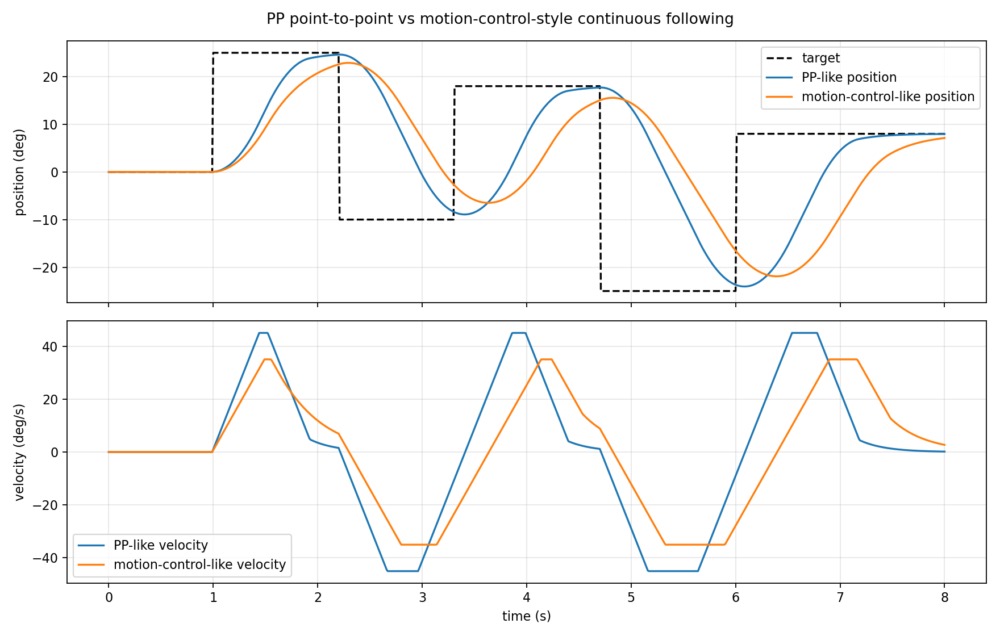

# EL05 Python 控制库

这是一个用于控制 RobStride EL05 关节电机的 Python 小型封装库。当前实现基于 EL05 说明书中的私有 CAN 协议，并通过现有 USB-CAN 板的串口封装发送数据。

项目目标是把底层的 CAN ID、参数 index、字节序、串口封装等细节封装起来，让使用者可以用更清楚的 Python 方法控制电机，例如：

```python
bus.set_target_deg(MOTOR_ID, 10)
bus.motion_control(MOTOR_ID, ...)
```

## 学习文档

EL05 学习笔记与协议理解记录：

[飞书文档：EL05 学习记录](https://scnmu7oloz8g.feishu.cn/wiki/WyHIw5TiliSA7Nk6tpLcobXZnRH)

## 硬件图片

以下图片为作者实拍，仅用于硬件识别和连接说明。

| EL05 电机 | USB-CAN 板 |
| --- | --- |
|  |  |

## 通信背景

当前控制链路是：

```text
Python 程序 -> 串口数据 -> USB-CAN 板 -> CAN 帧 -> EL05 电机
```

重要说明：EL05 说明书描述的是电机最终需要收到的 CAN 信号帧，不是这里的串口数据。说明书里的通信类型、29 位扩展 CAN ID、8 字节数据区、参数 index 等内容，都是针对 CAN 总线上的真实 CAN 帧。

本代码为了适配当前这块 USB-CAN 转换模块，先在 Python 里把目标 CAN 帧编码成该模块要求的串口数据，再由 USB-CAN 模块转换成 CAN 帧发给电机。也就是说，这份代码本质上是在模拟上位机给 USB-CAN 模块发送串口指令，而不是直接通过标准 CAN 接口发帧。

更规范的工程做法是使用 CAN 适配器和对应驱动/API，直接发送说明书规定的 CAN 扩展帧。若更换 USB-CAN 模块或改用 SocketCAN、PCAN、Kvaser、ZLG 等标准 CAN 接口，通常应保留 CAN ID 和 8 字节数据区的协议逻辑，但替换掉本项目里的串口封装部分。

EL05 说明书规定的是电机最终收到的真实 CAN 帧，包括：

- 29 位扩展 CAN ID
- 8 字节 CAN 数据区
- 私有协议通信类型
- 参数 index，例如 `0x7005`、`0x7016`、`0x7024`、`0x7025`

当前 USB-CAN 板接收的是串口数据，再转换成 CAN 帧。当前代码使用的串口帧格式是：

```text
AT + packed_id + 08 + data8 + CRLF
```

其中 ID 包装规则是：

```python
packed_id = (can_id << 3) | 0x04
```

注意：这个包装规则属于当前 USB-CAN 串口链路，不是 EL05 说明书内容。

## 功能

- 构造 EL05 私有协议 29 位 CAN ID
- 将 CAN 帧包装成当前 USB-CAN 板需要的串口帧
- 停止、使能、清故障
- 单个参数读写
- PP 位置模式
- 速度模式
- 电流模式
- CSP 位置模式
- 运控模式
- 基础反馈帧解析

## 文件说明

- `el05.py`  
  核心库，建议长期保留。

- `angle_control.py`  
  角度控制辅助库。包含单圈角度理解、最近等价 raw 目标、反馈跳变检查，以及可复用的 `return_motors_to_zero()` 初始化函数。

- `PP_simplified.py`  
  已经实测可动的 PP 模式最小脚本，作为基准保留。

- `examples/`  
  示例脚本目录。保留通信检查、反馈读取、回原位初始化、PP、运控、速度、电流、CSP 的基础示例；每个示例的用途和建议运行顺序见 `examples/README.md`。

- `CAN-USB/`  
  CAN ID 与串口包装 ID 的转换小工具。

## 安装依赖

```powershell
pip install -r requirements.txt
```

当前只依赖：

```text
pyserial
```

## 运行前检查

运行前请确认：

- 电机供电正常。
- CAN_H、CAN_L、GND 接线正确。
- USB-CAN 板已连接电脑。
- 串口号正确，例如 `COM6`。
- 电机 CAN ID 正确，例如 `1`。
- 官方上位机已关闭，避免占用串口。
- 机械限位安全，第一次测试用小角度。

## 快速开始

仓库里的示例脚本会自动把 `lib/` 加入 Python 搜索路径。如果你自己新建脚本，建议先复制 `examples/pp_basic.py` 的文件头部。

最小 PP 位置控制：

```python
import time
from el05 import EL05Bus

MOTOR_ID = 1

with EL05Bus(port="COM6") as bus:
    bus.set_pp_mode(MOTOR_ID)
    time.sleep(0.05)
    bus.enable(MOTOR_ID)
    time.sleep(0.05)
    bus.set_target_deg(MOTOR_ID, 10)
    time.sleep(2.0)
```

带速度和加速度限制的 PP 控制：

```python
import time
from el05 import EL05Bus

MOTOR_ID = 1

with EL05Bus(port="COM6") as bus:
    bus.stop(MOTOR_ID)
    time.sleep(0.08)
    bus.set_pp_mode(MOTOR_ID)
    time.sleep(0.05)
    bus.enable(MOTOR_ID)
    time.sleep(0.05)
    bus.set_pp_speed(MOTOR_ID, 1.0)
    time.sleep(0.05)
    bus.set_pp_acc(MOTOR_ID, 1.0)
    time.sleep(0.05)
    bus.set_target_deg(MOTOR_ID, 10)
    time.sleep(2.0)
    bus.stop(MOTOR_ID)
```

运控模式示例：

```python
import math
import time
from el05 import EL05Bus

MOTOR_ID = 1

with EL05Bus(port="COM6") as bus:
    bus.stop(MOTOR_ID)
    time.sleep(0.08)
    bus.set_motion_mode(MOTOR_ID)
    bus.enable(MOTOR_ID)
    time.sleep(0.05)
    bus.set_feedback_active(MOTOR_ID, True)
    fb = bus.wait_feedback(MOTOR_ID, timeout=0.5)
    if fb.fault_bits:
        raise RuntimeError(f"motor {MOTOR_ID} fault bits: 0x{fb.fault_bits:02x}")

    target = 5 * math.pi / 180
    for _ in range(200):
        bus.receive_feedback(0.001)
        bus.motion_control(
            MOTOR_ID,
            pos_rad=target,
            vel_rad_s=0.0,
            kp=3.0,
            kd=0.5,
            torque_nm=0.0,
        )
        time.sleep(0.01)

    bus.stop(MOTOR_ID)
```

实时跟随时不要每条指令后等待 `0.2~0.5s`。更合理的结构是：初始化阶段等待反馈确认，实时阶段固定频率循环，持续读取最近反馈，并设置反馈超时保护。

## 固定回原位初始化

后续流程需要从原位开始时，建议先调用 `return_motors_to_zero()`。它不会依赖断电前的多圈位置记忆，而是读取当前 raw 反馈，折算单圈角度做安全检查，再发送离当前位置最近的等价 raw 零位目标。

```python
from angle_control import return_motors_to_zero
from el05 import EL05Bus

MOTOR_IDS = [1, 2, 3]
ALLOWED_ANGLE_DEG = {
    1: (-90.0, 90.0),
    2: (-180.0, 180.0),
    3: (-180.0, 180.0),
}

with EL05Bus(port="COM7", timeout=0.005) as bus:
    try:
        return_motors_to_zero(bus, MOTOR_IDS, ALLOWED_ANGLE_DEG)

        # 后续动作写在这里；此时电机仍保持在 motion mode 原位。

    finally:
        for motor_id in MOTOR_IDS:
            bus.stop(motor_id)
```

## 支持的模式

### PP 位置模式

适合让电机运动到指定角度。电机会根据速度和加速度限制自行规划运动。

PP 更像点到点运动：单次运动可以平滑，但连续目标频繁变化时，多个点到点轨迹拼接起来不一定自然。

常用方法：

```python
bus.set_pp_mode(MOTOR_ID)
bus.enable(MOTOR_ID)
time.sleep(0.05)
bus.set_pp_speed(MOTOR_ID, 1.0)
bus.set_pp_acc(MOTOR_ID, 1.0)
bus.set_target_deg(MOTOR_ID, 10)
```

### 速度模式

适合连续旋转机构，例如轮子、转台。有限角度关节上要谨慎使用。

```python
bus.set_speed_mode(MOTOR_ID)
bus.enable(MOTOR_ID)
time.sleep(0.05)
bus.set_limit_current(MOTOR_ID, 2.0)
bus.set_speed_acc(MOTOR_ID, 1.0)
bus.set_speed_ref(MOTOR_ID, rad_s=0.5)
```

完整示例见：

```powershell
python examples/speed_basic.py
```

### 电流模式

电流模式发送 Iq 电流指令，风险较高，因为它不是位置目标控制。

```python
bus.set_current_mode(MOTOR_ID)
bus.enable(MOTOR_ID)
time.sleep(0.05)
bus.set_current_ref(MOTOR_ID, amp=0.2)
```

初学和普通位置控制不建议优先使用电流模式。

完整示例见：

```powershell
python examples/current_basic.py
```

### CSP 位置模式

CSP 适合上位机自己生成轨迹点，并周期性发送位置目标。

```python
bus.set_csp_mode(MOTOR_ID)
bus.enable(MOTOR_ID)
time.sleep(0.05)
bus.set_limit_speed(MOTOR_ID, 1.0)
bus.set_target_deg(MOTOR_ID, 10)
```

完整示例见：

```powershell
python examples/csp_basic.py
```

### 运控模式

运控模式发送：

- 目标位置
- 目标速度
- `Kp`
- `Kd`
- 前馈力矩

近似控制逻辑：

```text
tau = Kp * (pos_des - pos_actual)
    + Kd * (vel_des - vel_actual)
    + torque_ff
```

`vel_rad_s = 0` 不代表电机不能动，只代表期望速度为 0。只要位置误差不为 0，电机仍会因为位置项而运动。

运控模式使用 `motion_control()` 发送控制帧。参数必须在说明书量程内，超范围会直接报错。

下面的仿真图展示了 PP 点到点风格和运控连续跟随风格的曲线差异：



## 安全注意

- 第一次测试使用小角度，例如 `5~10 deg`。
- 初始速度、加速度要低。
- 切换模式前建议先 `stop()`。
- 运控模式先用低 `Kp/Kd`，前馈力矩先设为 `0`。
- 电流模式风险高，不建议初学阶段作为主控制方式。
- 不要随意发送协议切换、波特率修改、电机 ID 修改、参数保存等持久化命令。
- 如果电机没有响应，优先检查接线、供电、串口号、电机 ID，而不是盲目改协议参数。

## 通信检查

可以运行：

```powershell
python examples/check_no_motion.py
```

这个脚本只发送停止/清故障和读取版本命令，不会使能电机，也不会发送目标位置。

适合检查：

- 串口是否正常
- USB-CAN 板是否正常
- CAN 接线是否正常
- 电机是否有基础回应

## 读取反馈

`el05.py` 会把通信类型 2 的反馈解析成 `Feedback` 对象，包含：

- `position_rad`
- `velocity_rad_s`
- `torque_nm`
- `temperature_c`
- `fault_bits`
- `mode_state`

示例：

```python
from el05 import EL05Bus

MOTOR_ID = 1

with EL05Bus(port="COM6") as bus:
    bus.stop(MOTOR_ID)
    bus.set_feedback_active(MOTOR_ID, True)
    bus.receive_feedback(0.1)
    print(bus.get_feedback(MOTOR_ID))
```

常用方法：

```python
bus.receive_feedback(0.01)
bus.get_position_deg(MOTOR_ID, max_age=0.5)
bus.get_velocity_rad_s(MOTOR_ID, max_age=0.5)
bus.get_torque_nm(MOTOR_ID, max_age=0.5)
bus.get_temperature_c(MOTOR_ID, max_age=0.5)
bus.get_fault_bits(MOTOR_ID, max_age=0.5)
```

注意：`mode_state` 是电机状态机状态，例如 Reset/Cali/Motor，不等于 `run_mode` 的 PP/速度/电流/运控。

## 当前限制

- 当前库实现的是 EL05 私有协议。
- 私有协议下的主要运行模式已经覆盖：运控模式、PP 位置模式、速度模式、电流模式、CSP 位置模式。
- `zero_sta` 使用说明书类型 18 写入参数 `0x7029`，如需断电保持，需要再发送类型 22 保存参数。
- 位置控制统一使用 raw 坐标；底层库只解析反馈，机构姿态窗口和跳变保护放在 `angle_control.py` 和业务脚本里。
- 当前库没有实现 MIT 标准帧协议。
- 当前库没有实现 CANopen。
- USB-CAN 串口封装规则来自当前硬件链路和已验证代码，不是 EL05 说明书本身。
- 反馈解析是基础版本，正式工程建议继续增加超时处理、故障处理、日志和参数确认。

## 推荐使用顺序

1. 运行 `examples/check_no_motion.py` 检查通信。
2. 运行 `PP_simplified.py` 确认基准脚本可动。
3. 运行 `examples/pp_basic.py` 测试库版本 PP 控制。
4. 确认 PP 稳定后，再尝试 `examples/motion_control_basic.py`。
5. 后续流程需要从原位开始时，先参考 `examples/motion_return_zero.py` 调用 `return_motors_to_zero()`。
6. 如需连续轨迹，再参考 `examples/csp_basic.py`。
7. 如需连续旋转，再参考 `examples/speed_basic.py`。
8. 如需电流实验，再参考 `examples/current_basic.py`，并使用极小电流短时间测试。
