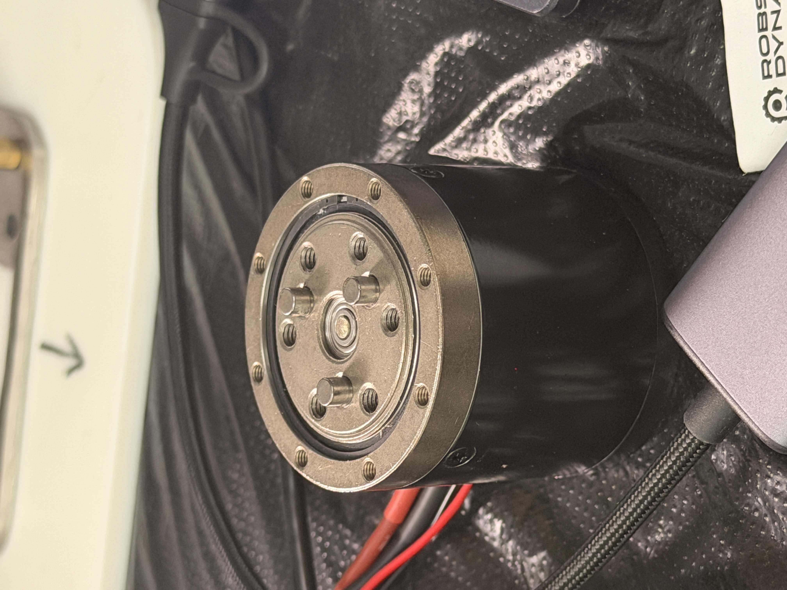
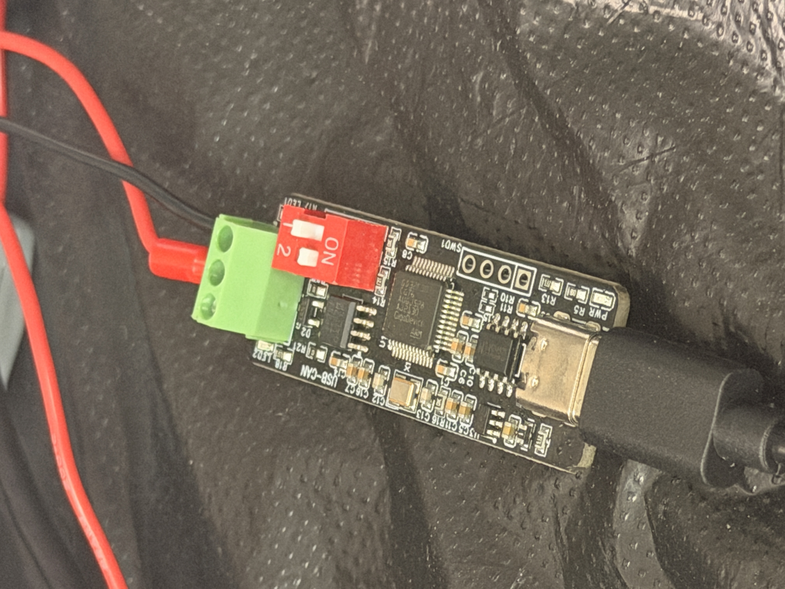

# EL05 Python 控制库

这是一个用于控制 RobStride EL05 关节电机的 Python 小型封装库。当前实现基于 EL05 说明书中的私有 CAN 协议，并通过现有 USB-CAN 板的串口封装发送数据。

项目目标是把底层的 CAN ID、参数 index、字节序、串口封装等细节封装起来，让使用者可以用更清楚的 Python 方法控制电机，例如：

```python
motor.move_pp_deg(10)
motor.motion_control(...)
```

## 学习文档

EL05 学习笔记与协议理解记录：

[飞书文档：EL05 学习记录](https://scnmu7oloz8g.feishu.cn/wiki/WyHIw5TiliSA7Nk6tpLcobXZnRH)

## 硬件图片

以下图片为作者实拍，仅用于硬件识别和连接说明。

| EL05 电机 | USB-CAN 板 |
| --- | --- |
|  |  |

## 通信背景

当前控制链路是：

```text
Python 程序 -> 串口数据 -> USB-CAN 板 -> CAN 帧 -> EL05 电机
```

EL05 说明书规定的是电机最终收到的真实 CAN 帧，包括：

- 29 位扩展 CAN ID
- 8 字节 CAN 数据区
- 私有协议通信类型
- 参数 index，例如 `0x7005`、`0x7016`、`0x7024`、`0x7025`

当前 USB-CAN 板接收的是串口数据，再转换成 CAN 帧。当前代码使用的串口帧格式是：

```text
AT + packed_id + 08 + data8 + CRLF
```

其中 ID 包装规则是：

```python
packed_id = (can_id << 3) | 0x04
```

注意：这个包装规则属于当前 USB-CAN 串口链路，不是 EL05 说明书内容。

## 功能

- 构造 EL05 私有协议 29 位 CAN ID
- 将 CAN 帧包装成当前 USB-CAN 板需要的串口帧
- 停止、使能、清故障
- 单个参数读写
- PP 位置模式
- 速度模式
- 电流模式
- CSP 位置模式
- 运控模式
- 基础反馈帧解析

## 文件说明

- `el05.py`  
  核心库，建议长期保留。

- `PP_simplified.py`  
  已经实测可动的 PP 模式最小脚本，作为基准保留。

- `examples/`  
  示例脚本目录。每个示例的用途和建议运行顺序见 `examples/README.md`。

- `CAN-USB/`  
  CAN ID 与串口包装 ID 的转换小工具。

## 安装依赖

```powershell
pip install -r requirements.txt
```

当前只依赖：

```text
pyserial
```

## 运行前检查

运行前请确认：

- 电机供电正常。
- CAN_H、CAN_L、GND 接线正确。
- USB-CAN 板已连接电脑。
- 串口号正确，例如 `COM6`。
- 电机 CAN ID 正确，例如 `1`。
- 官方上位机已关闭，避免占用串口。
- 机械限位安全，第一次测试用小角度。

## 快速开始

最小 PP 位置控制：

```python
import time
from el05 import EL05

with EL05(port="COM6", motor_id=1) as motor:
    motor.set_pp_mode()
    time.sleep(0.05)
    motor.enable()
    time.sleep(0.05)
    motor.set_target_deg(10)
    time.sleep(2.0)
```

带速度和加速度限制的 PP 控制：

```python
import time
from el05 import EL05

with EL05(port="COM6", motor_id=1) as motor:
    motor.stop()
    time.sleep(0.08)
    motor.configure_pp(speed=1.0, acc=1.0)
    motor.set_target_deg(10)
    time.sleep(2.0)
    motor.stop()
```

运控模式示例：

```python
import math
import time
from el05 import EL05

with EL05(port="COM6", motor_id=1) as motor:
    motor.stop()
    time.sleep(0.08)
    motor.configure_motion()
    motor.require_no_fault(timeout=0.5)

    target = 5 * math.pi / 180
    for _ in range(200):
        motor.receive_feedback(0.001)
        motor.motion_control_safe(
            pos_rad=target,
            vel_rad_s=0.0,
            kp=3.0,
            kd=0.5,
            torque_nm=0.0,
        )
        time.sleep(0.01)

    motor.stop()
```

实时跟随时不要每条指令后等待 `0.2~0.5s`。更合理的结构是：初始化阶段等待反馈确认，实时阶段固定频率循环，持续读取最近反馈，并设置反馈超时保护。

## 支持的模式

### PP 位置模式

适合让电机运动到指定角度。电机会根据速度和加速度限制自行规划运动。

常用方法：

```python
motor.configure_pp(speed=1.0, acc=1.0)
motor.set_target_deg(10)
motor.move_pp_deg(10, speed=1.0, acc=1.0)
```

### 速度模式

适合连续旋转机构，例如轮子、转台。有限角度关节上要谨慎使用。

```python
motor.run_speed(rad_s=0.5, limit_current=2.0, acc=1.0)
```

完整示例见：

```powershell
python examples/speed_mode_basic.py
```

### 电流模式

电流模式发送 Iq 电流指令，风险较高，因为它不是位置目标控制。

```python
motor.run_current(amp=0.2)
```

初学和普通位置控制不建议优先使用电流模式。

完整示例见：

```powershell
python examples/current_mode_basic.py
```

### CSP 位置模式

CSP 适合上位机自己生成轨迹点，并周期性发送位置目标。

```python
motor.configure_csp(limit_speed=1.0)
motor.set_csp_target_deg(10)
```

完整示例见：

```powershell
python examples/csp_position_basic.py
```

### 运控模式

运控模式发送：

- 目标位置
- 目标速度
- `Kp`
- `Kd`
- 前馈力矩

近似控制逻辑：

```text
tau = Kp * (pos_des - pos_actual)
    + Kd * (vel_des - vel_actual)
    + torque_ff
```

`vel_rad_s = 0` 不代表电机不能动，只代表期望速度为 0。只要位置误差不为 0，电机仍会因为位置项而运动。

实时控制建议使用 `motion_control_safe()`，它会检查反馈超时、故障位，并限制位置、速度、`Kp`、`Kd` 和前馈力矩。

## 安全注意

- 第一次测试使用小角度，例如 `5~10 deg`。
- 初始速度、加速度要低。
- 切换模式前建议先 `stop()`。
- 运控模式先用低 `Kp/Kd`，前馈力矩先设为 `0`。
- 电流模式风险高，不建议初学阶段作为主控制方式。
- 不要随意发送协议切换、波特率修改、电机 ID 修改、参数保存等持久化命令。
- 如果电机没有响应，优先检查接线、供电、串口号、电机 ID，而不是盲目改协议参数。

## 通信检查

可以运行：

```powershell
python examples/recover_check_no_motion.py
```

这个脚本只发送停止/清故障和读取版本命令，不会使能电机，也不会发送目标位置。

适合检查：

- 串口是否正常
- USB-CAN 板是否正常
- CAN 接线是否正常
- 电机是否有基础回应

## 读取反馈

`el05.py` 会把通信类型 2 的反馈解析成 `Feedback` 对象，包含：

- `position_rad`
- `velocity_rad_s`
- `torque_nm`
- `temperature_c`
- `fault_bits`
- `mode_state`

示例：

```python
from el05 import EL05

with EL05(port="COM6", motor_id=1) as motor:
    motor.stop()
    feedback = motor.update_feedback(0.1)
    print(motor.feedback_summary())
```

常用方法：

```python
motor.update_feedback(0.01)
motor.get_position_deg(max_age=0.5)
motor.get_velocity_rad_s(max_age=0.5)
motor.get_torque_nm(max_age=0.5)
motor.get_temperature_c(max_age=0.5)
motor.get_fault_bits(max_age=0.5)
```

注意：`mode_state` 是电机状态机状态，例如 Reset/Cali/Motor，不等于 `run_mode` 的 PP/速度/电流/运控。

## 当前限制

- 当前库实现的是 EL05 私有协议。
- 当前库没有实现 MIT 标准帧协议。
- 当前库没有实现 CANopen。
- USB-CAN 串口封装规则来自当前硬件链路和已验证代码，不是 EL05 说明书本身。
- 反馈解析是基础版本，正式工程建议继续增加超时处理、故障处理、日志和参数确认。

## 推荐使用顺序

1. 运行 `examples/recover_check_no_motion.py` 检查通信。
2. 运行 `PP_simplified.py` 确认基准脚本可动。
3. 运行 `examples/pp_minimal.py` 测试库版本 PP 控制。
4. 运行 `examples/pp_with_limits.py` 使用速度/加速度限制。
5. 确认 PP 稳定后，再尝试 `examples/motion_control_basic.py`。
6. 如需连续轨迹，再参考 `examples/csp_position_basic.py`。
7. 如需连续旋转，再参考 `examples/speed_mode_basic.py`。
8. 如需电流实验，再参考 `examples/current_mode_basic.py`，并使用极小电流短时间测试。
9. 需要实时跟随时，再参考 `examples/head_follow_motion_safe.py`。
